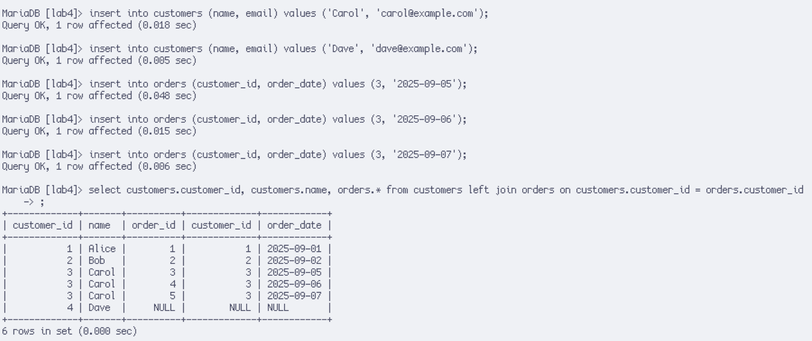
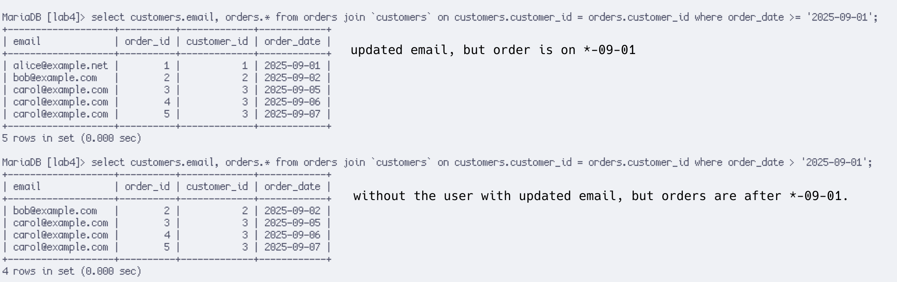
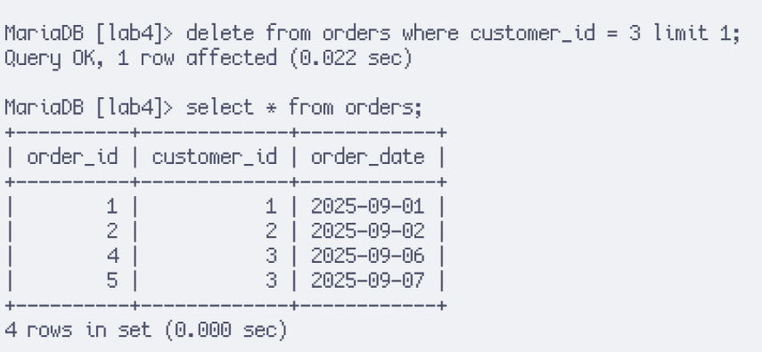
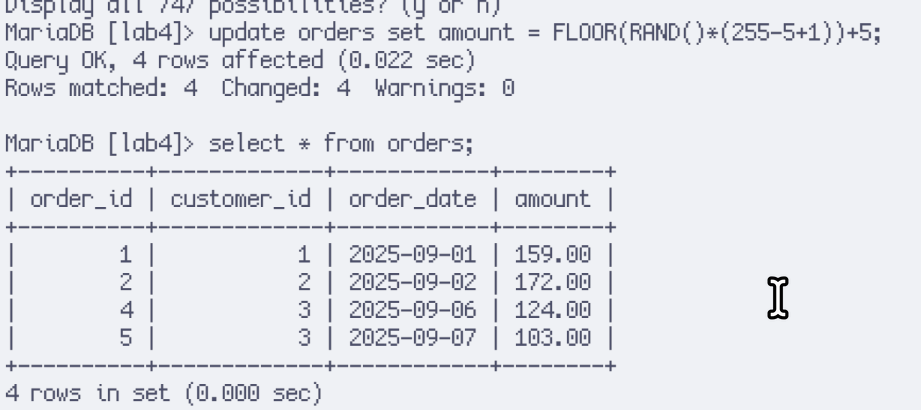

_p.s. i have made the primary keys `auto_increment` because i don't want to type useless stuff constantly._

# Question 1

The use of `LEFT JOIN` is required to list all available customers, even those without any orders (e.g. UID 4; Dave).

# Question 2

The foreign key successfully protected the database from inserting garbage data (i.e. with a non-existent customer), that means references to the customers are protected and checked at row insertion time.

# Question 3

`INNER JOIN` (i.e. join with nothing; regular join) and `OUTER JOIN` does not really have any difference in my situation because the user with any difference is already excluded.

# Question 4

The delete operation failed because there are other rows in other tables that still reference the current row. The foreign key constraint prevents the database from getting out of sync with data inside.

# Question 5

With `JOIN`, `SUM` can be used to calculate summations for data that matches specific things, especially with `group by`, it can be used to calculate values for multiple rows.
