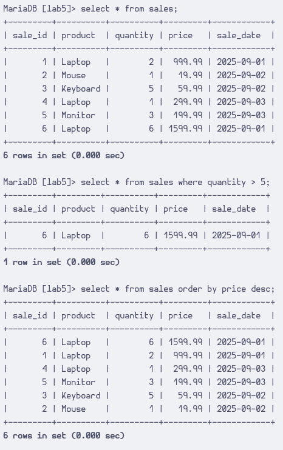
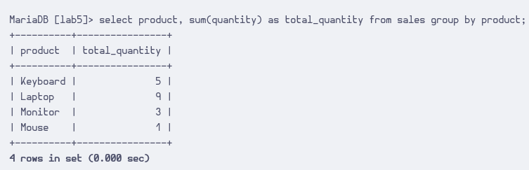
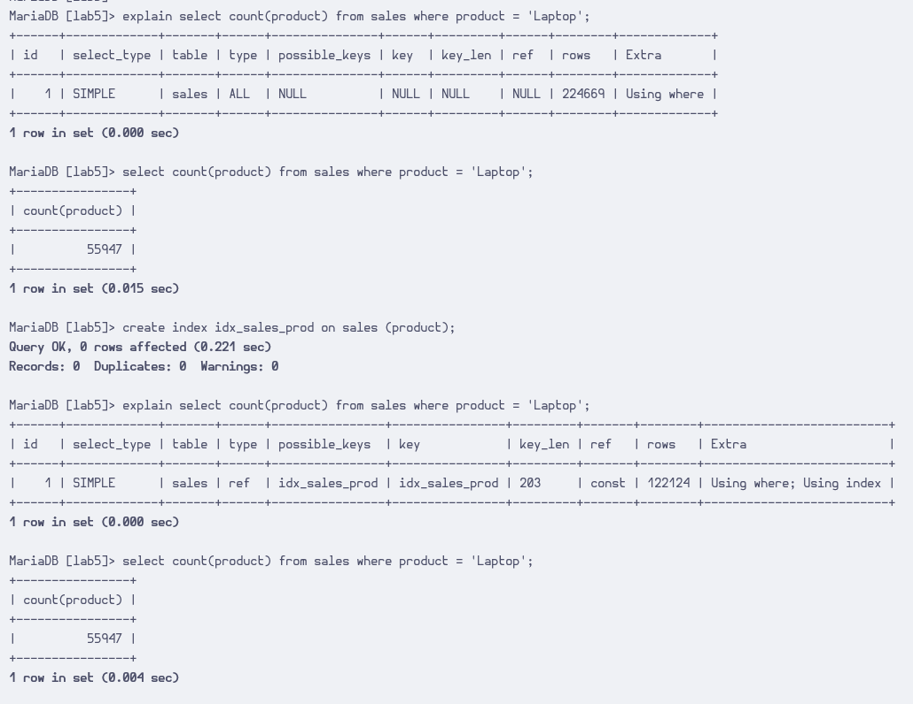

# Question 1

The `WHERE` clause filters out unwanted queries.

# Question 2

The `ORDER BY` clause makes the output sorted in a certain order by a column, ascending by default. `ASC` and `DESC` is used to specify ascending and descending order.

```sql
-- ascending 1
select * from table order by column asc;
-- ascending 2
select * from table order by column;
-- descending
select * from table order by column desc;
```

# Question 3

The `GROUP BY` clause cauess the output to be grouped according to some criteria. The SQL command executed in the exercise groups the result by the product name, and with the `SUM` function it can display an aggregate sum of the items' total sale count.

Without `GROUP BY`, `SUM` would display the sale count of all items. In addition, the selected product column would output something basically meaningless.

# Question 4

Aggregate functions can produce a sum or count of items matching some criteria, just like the very last command in the lab.

# Question 5

When `SELECT`ing with `WHERE` clauses, indexes can help to find rows quickly which can drastically improve query performance.

As a very small example, a table with millions of entries and an index on a column can already produce visible query speedups.


